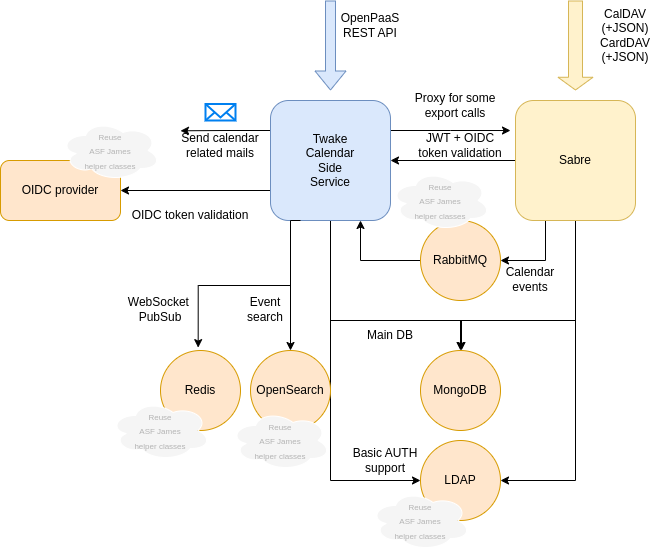

# Twake Calendar Side service

## Goals

This service aims at interacting with a [esn-sabre](https://github.com/linagora/esn-sabre/) backend and OpenPaaS single 
page applications being [calendar](https://github.com/linagora/esn-frontend-calendar) and 
[contacts](https://github.com/linagora/esn-frontend-contacts).

It vows to strictly follow OpenPaaS APIs as integration tested by [dav-integrationTesting](https://ci.linagora.com/btellier/dav-integrationtesting).

It vows to follow OpenPaaS DB structure (at least for now as we might see DB refactoring dropping MongoDB).

However, despite those above statements it shall be seen as a very aggressive refactoring as it technically is a full rewrite.

We aim for a pragmatic approach by reusing most of the tooling that made Twake mail successful.

## Running it

We provide a full [demo](app/docker-sample/README.md) of the entire calendar stack, including this calendar side-service,
the esn-sabre dav server, and all single page applications with a sample OIDC setup.

Below sections refers how to run specifically the side service:

 - [Compile and run with CLI](docs/run/run-cli.md)
 - [Run with docker](docs/run/run-docker.md)

## Configuring it

Please refer to the [sample configuration](app/src/main/conf).

We will soon provide more details here.

## Contributing

At LINAGORA we warmly welcome feedbacks and contributions.

We expect quality contributions matching the scope of the project.

We recommend discussing the contribution (GitHub issues or discussion) prior writing some code.

LINAGORA owns the code base so alone is entitled to decide what shall be accepted or not as a contribution
and became owner of the contribution. However, we will retain paternity of the contribution (git history
and if applicable / requested in comments)

## Roadmap

We aim for replacing [OpenPaaS](https://open-paas.org/) by the end of 2025.

Then we might add websocket push to this project.

Next development items are not specified yet. We could envision replacing [MongoDB backend](https://www.mongodb.com/) by
[PostgreSQL](https://www.postgresql.org/) document DB but this is not decided yet.

## Architecture

In addition to this target architecture, in order to allow easy deployment of our solution, the 
`Twake Calendar Side Service` will also proxy HTTP calls it do not handle (yet) to the soon-to-be-replaced 
`OpenPaaS` server.

Regarding observability, we intend Twake Calendar Side Service to be on par with Twake Mail: structured JSON logs 
collected via [Loki](https://grafana.com/oss/loki/), metrics gathered by [Prometheus](https://prometheus.io/). 

Implemented Webadmin APIs: metrics, heathcheck, users and domain routes.

### Features

Exposes a subset of the OpenPaaS API, allowing OpenPaaS SPA to run smoothly atop this side service.

Proxies dav calls in order to enable direct OIDC authentication for the SPA in order not to rely on secondary authentication
mechanisms.

Exposes a webadmin interface for management.

Additionally, the side service handles sending emails for the calendar stack. Mails are internationalized based on user
settings. This includes:

- Even email notification:
    - Upon new event send calendar invites to attendees
    - Upon event updates notifies attendees
    - Upon event cancellation, notifies attendees
    - Upon attendee attendance status update, notifies the organizer
    - Upon counter proposal, sends a email to the organizer to moderate the counter proposal
- Event alarms: send email reminder to the user as set up in the event on fix date, which involves scheduling.
- Resource moderation request, allowing resource administrator to accept/deny events in the name of resources
- Resource moderation notifications, letting event organizer know about resource moderation decisions
- Calendar / address book import notifications

The side service also enables synchronizing domain members into ESN-Sabre DAV server.

### Persistance

[**MongoDB**](https://www.mongodb.com/) is used as a primary data store. Entities are stored in order to be retro-compatible
with the OpenPaaS dataformat making a transition from OpenPaaS to the side service trivial. Indexes matching the application
access pattern are created upon application start.

[**OpenSearch**](https://opensearch.org/) is used for:
 - user and contact search as part of the `people search api`. This is implemented by leveraging the 
[Twake Mail auto-complete](https://github.com/linagora/tmail-backend/blob/master/docs/modules/ROOT/pages/tmail-backend/features/contactAutocomplete.adoc).
Twake calendar thus blindly reads the entries added by Twake mail, which is currently responsible onf the indexing process.
 - event search.The side service listen calendar events pushed by Sabre on RabbitMQ in order to maintain an index on OpenSearch
whch is queries upon event search.

[**RabbitMQ**](https://www.rabbitmq.com/) is used in order to react to change performed atop the esn-sabre DAV server.

[**Redis**](https://redis.io/) is used as a cache to store OpenID connect access token hash thus lowring the load on the identity server. 
Invalidation of this cache is possible by relying on back-channel logout.

**LDAP** data storage is possible and allows for:
 - Synchronizing domain members into ESN-Sabre DAV server
 - Back basic authentication if exposed

### Flux matrix

The side service relies on the following other services:

**esn-sabre DAV server** holds the calendar / contacts data and is in charge of manipulating them. The side-service calls the
DAV server in order to:
 - Manage the secret link access: it validates the secret link then proxy theDAV calendar export
 - Support excal: where a non authenticated third party user receives an invite from one of our users excal SPA offers 
a link for this user to update his participation. The token enbedded in the SPA is validated by the side service which 
acts accordingly on the DAV server.
 - Synchronizing domain members: the side service ingest data from a LDAP and use it to poputate the domain member address book
in sabre through the use of a "Technical Token". 
 - Calendar and address book import: after uploading data to the side service the side service pushes each relevant items
into the corresponding DAV collection.
 - DAV Proxy: the side service expose an endpoint authenticated with OIDC that wraps the DAV api. 
 - Alarm service and event indexing service might read DAV data in order to maintain their own projections.

**Twake Mail** (or any SMTP submission service) is used to send calendar related emails.

## Credits

Developed with <3 at [LINAGORA](https://linagora.com) !