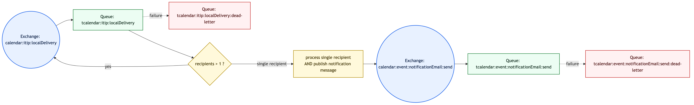
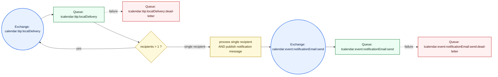

# Async Scheduling

The side service implements an event-driven architecture where **esn-sabre** publishes domain events to RabbitMQ exchanges and the side service reacts asynchronously through dedicated consumers.

The architectural decision is documented in [ADR-0001](https://github.com/linagora/esn-sabre/blob/master/adr/0001-async-scheduling.md).

All exchanges are **FANOUT** and durable. All queues have an associated dead-letter queue for failed messages.

---

## RabbitMQ Consumers (ADR-0001 Scope)

| Consumer class | What it does | Publisher | Listens to exchange(s) | Queue(s) | Dead-letter queue(s) | Produces to |
|---|---|---|---|---|---|---|
| `ItipLocalDeliveryConsumer` | Implements ADR-0001 fan-out then process for local delivery. Phase 1 splits N recipients into N single-recipient messages on the same exchange. Phase 2 calls `POST /itip` and publishes email notification payload. | esn-sabre DAV server (via `AMQPSchedulePlugin`) | `calendar:itip:localDelivery` | `tcalendar:itip:localDelivery` | `tcalendar:itip:localDelivery:dead-letter` | `calendar:event:notificationEmail:send` via `ItipEmailNotificationPublisher` |
| `EventEmailConsumer` | Sends notification emails based on payload emitted by `ItipLocalDeliveryConsumer`. | `ItipEmailNotificationPublisher` (inside side service) | `calendar:event:notificationEmail:send` | `tcalendar:event:notificationEmail:send` | `tcalendar:event:notificationEmail:send:dead-letter` | - |

---

## RabbitMQ Topology

Mermaid source:

